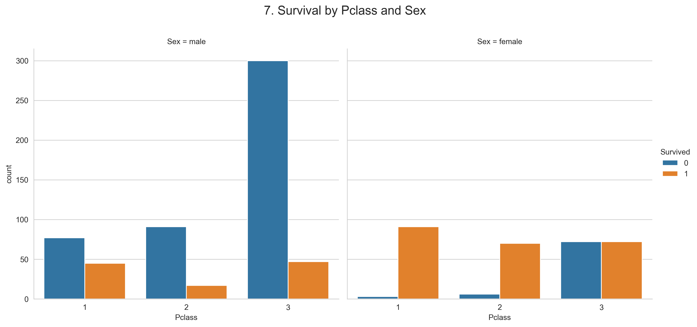

# Titanic EDA Dashboard

##Description
This project performs **exploratory data analysis (EDA) on the Titanic Dataset.
It includes **data cleaning, feature engineering, and 7 key insights** visualized with Python using pandas, matplotlib, and seaborn.
The goal is to understand patterns in passenger survival and present them professionally

## Dataset
- Source: [Kaggle Titanic Dataset] (https://www.kaggle.com/c/titanic/data)
- Contains passenger information: Age, Sex, Pclass, Fare, Embarked, SibSp, Parch, etc.
- Cleaned dataset is included: `titanic_cleaned.csv`

## Features
- `Survived` : Target variable (0 = No, 1 = yes)
- `Pclass` : Passenger Class (1st, 2nd, 3rd)
- `sex` : Male/Female
- `Age` : Age of passenger
- `SibSp` : # of siblings/spouses aboard
- `Parch` : # of parents/children aboard
-  `Fare` : Ticket fare
- `Embarked` : port of embarkation
- `FamilySize` : Total family aboard (sibSp + Parch +1)

## Setup
1. Clone the repository: git clone https://github.com/khalifa-4619/GreatSelf0Z3.git
2. Open `Titanic_Dataset.ipynb` in Jupiter Notebook
3. Install required packages if needed: ````bash pip install pandas matplotlib seaborn


### ** Visualizations / Key Insights**
1. Females survived more than males
2. 1st class passengers had higher survival
3. Younger passengers (esp. infants) survived more
4. Higher fare 'n higher survival
5. small families survived more than large families or alone
6. Survival varies by port of embarkation
7. Female 1st class passengers had the highest survival


8. 
## Tools & Libraries
- Python 3.x
- pandas
- numpy
- matplotlib
- seaborn
- Jupiter Notebook

## License
MIT License

## Contact
Abdussamad Kamaladdin - abdussamadkamaladdin@gmail.com